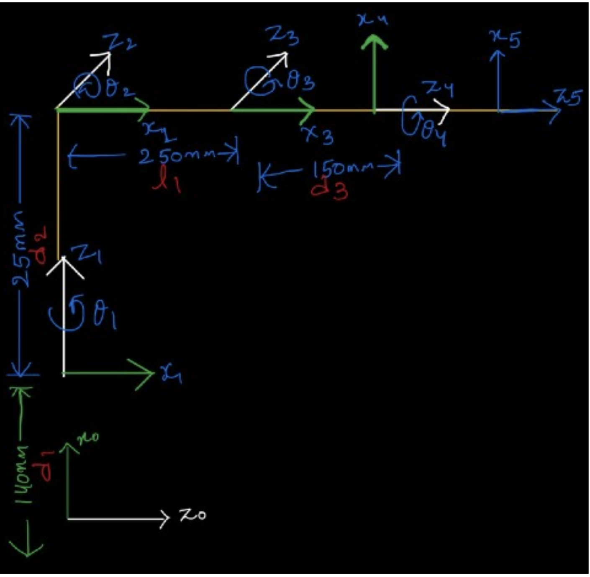
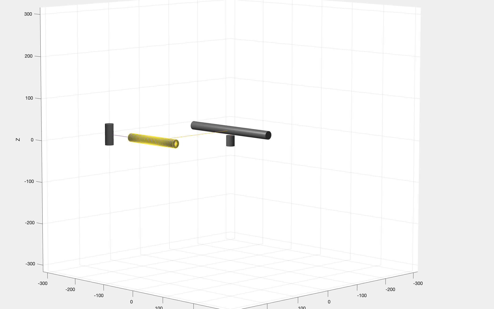
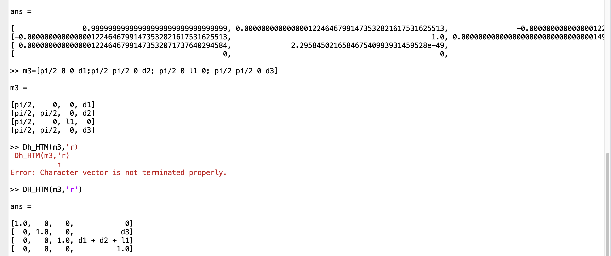
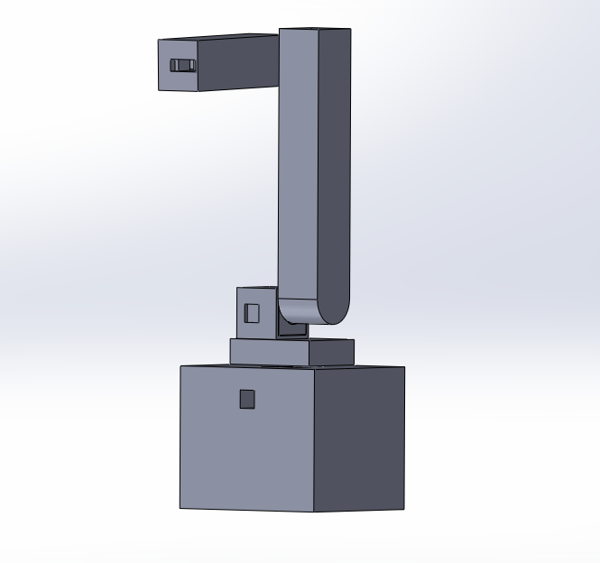

# 4-Axis Robotic Manipulator

## Project Timeline: July 2024 - December 2024  
---  

## 📑 Table of Contents 

1. [Introduction](#introduction)
2. [Design and Implementation](#design-and-implementation)

   * [Coordinate Frames and Kinematics](#coordinate-frames-and-kinematics)
   * [Forward Kinematics using DH Parameters](#forward-kinematics-fk-using-denavit-hartenberg-dh-parameters)
   * [MATLAB Simulation & Validation](#matlab-simulation--validation)
   * [CAD Design and 3D Printing](#cad-design-and-3d-printing)
   * [GUI for Robot Control](#gui-for-robot-control)
3. [System Operation](#system-operation)
4. [Future Improvements](#future-improvements)
5. [Conclusion](#conclusion)

---

## Introduction
Robotic arms in industries are a key element of automation, and they handle operations such as assembly, welding, painting, and pick-and-place. With a passion in robotics, this project aims to design and develop a 4-axis robotic manipulator that is designed for pick-and-place operations.

---

## Components Used
### Actuators:
- **Stepper Motors:** [NEMA 17 stepper motor (1.8° step angle) - 3 units](https://robu.in/product/nema-17-42hs40-1704-4-2-kg-cm-stepper-motor-round-type-shaft/)
- **Servo Motors:** [2 units (one for the 4th axis and one for the end effector)](https://robu.in/product/towerpro-mg996r-digital-high-torque-servo-motor/)
- **Microcontrollers:** [Arduino Uno](https://robu.in/product/arduino-uno-r3-ch340g-atmega328p-devlopment-board/) and [Smartelex Aryabhatta 8051](https://robu.in/product/smartelex-aryabhatta-8051-microcontroller-development-board-at89s52-with-onboard-usb-programmer/)
- **Motor Driver:** [A4988 Stepper Motor Driver](https://robu.in/product/a4988-driver-stepper-motor-driver-standard-quality/)
- **Power Supply:** 12V DC
- **Voltage Regulation:** [Buck Converter](https://robu.in/product/200w-20a-dc-dc-buck-converter-step-down-module-constant-current-led-driver-module/)

---

## Design and Implementation

### Coordinate Frames and Kinematics

- The manipulator consists of four rotational joints, each assigned a coordinate frame based on the Denavit-Hartenberg (DH) convention.
- DH parameters define the relative transformations between adjacent frames, essential for establishing forward kinematics (FK) equations.
- These coordinate frames are crucial for mapping the end-effector's position and orientation in 3D space, ensuring precise path planning and execution.

### Forward Kinematics (FK) using Denavit-Hartenberg (DH) Parameters
- FK determines the position and orientation of the end effector given the joint angles.
- The DH parameter table includes:
  - Link length
  - Link twist
  - Joint angle
  - Link offset
- Transformation matrices were derived for each link, leading to the overall transformation matrix that describes the end-effector pose relative to the base frame.
- These transformations enable precise calculations for pick-and-place operations and automation routines.

### MATLAB Simulation & Validation

**MATLAB’s Robotics Toolbox** was used to:
  - Define DH parameters and compute transformations.
  - Simulate joint movements and analyze motion.
  - Generate the workspace to evaluate reachability.
- MATLAB's visualization tools helped me confirm the manipulator's operational range before assembly, reducing errors related to singularities or mechanical collisions.

### CAD Design and 3D Printing

- The manipulator structure was designed using CAD software to ensure accurate dimensions and mechanical constraints.
- Components were 3D-printed using **PLA material** for a lightweight yet sturdy design.
- 
### GUI for Robot Control 

- A **Python-based GUI** was developed for intuitive robotic arm control.
- Features include:
  - Sliders for adjusting joint angles.
  - Buttons for executing predefined movements.
  - Home button
- The GUI communicates with the microcontroller via serial communication, sending commands to the **Arduino**, which processes them and drives the motors accordingly.
- A **gesture recording feature** allows to store and replay sequences of joint movements for automation.

---

### **Manipulator at the End**

## System Operation
1. Uploading the control code to the Arduino microcontroller.
2. Connecting the robotic arm to the GUI via USB (serial communication).
3. Launching the Python GUI application.
4. Adjusting the joint angles using the GUI controls to manipulate the arm.
5. Commands are sent to the microcontroller, which processes them and actuates the motors.
6. The **gesture recording function** stores movement sequences for automation, enabling smooth pick-and-place operations.

---

## Future Improvements
- **Implementation of Inverse Kinematics (IK):** Allowing users to input end-effector positions instead of joint angles for easier control.
- **Enhanced GUI Features:** Incorporating trajectory planning, predefined motion sequences, and a more user-friendly interface.
- **Upgrading the Microcontroller:** Switching to a more powerful microcontroller for improved precision and efficiency.
- **Machine Vision Integration:** Utilizing cameras and computer vision for object detection and automated grasping.
- **Optimized Mechanical Design:** Enhancing stability, increasing load-bearing capacity, and reducing mechanical wear.

---

## Conclusion
This project successfully developed a **4-axis robotic manipulator** for pick-and-place operations, integrating **kinematics modeling, MATLAB simulations, CAD design, and a user-friendly control interface**. Future advancements in **inverse kinematics, automation, and machine vision** will further enhance the functionality and versatility of the system.
